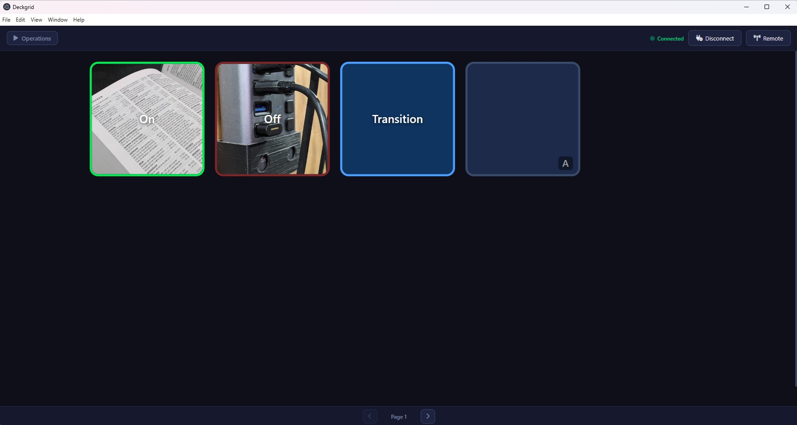
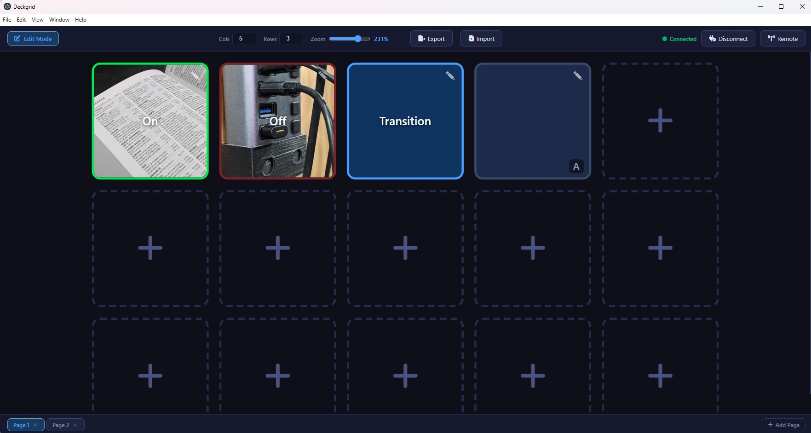
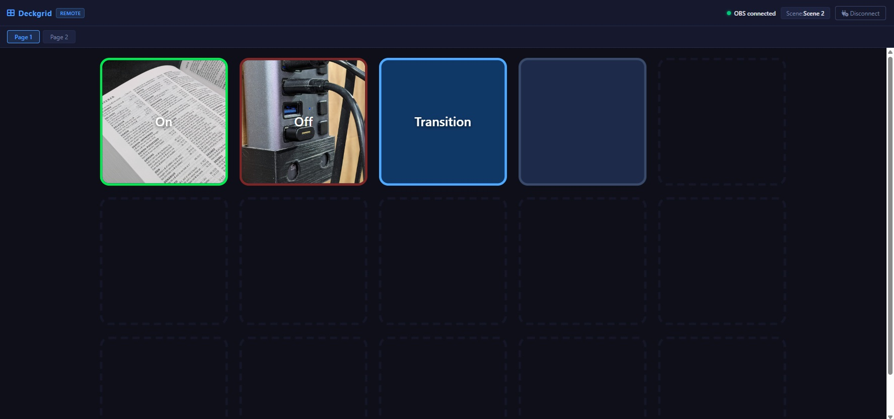

# Deckgrid

A virtual Stream Deck for controlling OBS Studio. Deckgrid is a desktop application built with Electron that gives you a fully customizable button grid connected to OBS via WebSocket.

I didn't like any of the other options that either cost too much or had annoying bugs. Threw it together with some copilot help.

## Features

- **Customizable button grid** - configure any number of rows (up to 8) and columns (up to 12) to fit your workflow.
- **Multi-page** - Switch between multiple grids with button actions to take you there instantly.
- **Edit and Operations modes** - switch between editing the layout and using the deck for live control.
- **OBS integration** - connects to OBS Studio over WebSocket (obs-websocket v5) to perform actions in real time:
  - Switch the current program scene.
  - Toggle the visibility of individual scene sources.
  - Trigger a Studio Mode transition.
- **Per-button appearance** - each button has independently configurable inactive and active states, including:
  - Label text and text position (top, center, or bottom).
  - Background color, border color, and text color.
  - A Font Awesome icon (e.g. `video`, `microphone`).
  - A custom image (JPG, PNG, GIF, WebP, or SVG).
- **Drag-and-drop reordering** - rearrange buttons by dragging them in Edit mode.
- **Zoom control** - scale the grid from 40% to 300% using a slider.
- **Persistent configuration** - your grid layout and all button settings are saved automatically and restored on next launch.

## Screenshots




## Requirements

- [Node.js](https://nodejs.org/) v18 or later (includes npm)
- [OBS Studio](https://obsproject.com/) with the **obs-websocket** plugin enabled (built in since OBS 28)

## Installation

1. Clone the repository:

   ```bash
   git clone https://github.com/pete1450/Deckgrid.git
   cd Deckgrid
   ```

2. Install dependencies:

   ```bash
   npm install
   ```

## Running Locally

```bash
npm start
```

This launches the Electron application. The window opens to an empty grid in Operations mode.

## Connecting to OBS

1. In OBS Studio, go to **Tools > WebSocket Server Settings**, enable the server, and note the port (default `4455`) and password.
2. In Deckgrid, click **Connect to OBS** in the top-right corner.
3. Enter the host (default `localhost`), port, and password, then click **Connect**.

The status indicator in the top bar turns green when the connection is established.

## Remote use

1. Host the /remote/index.html on a local server or open it on aother PC
2. Make sure the main app has the websocket server activated
3. Connect

## Usage

### Editing the grid

1. Click **Operations** to switch to **Edit mode** (the button label changes to reflect the current mode).
2. The column, row, and zoom controls appear in the top bar — adjust them to resize the grid.
3. Click any empty cell or existing button to open the button editor, where you can configure its action and appearance.
4. Drag buttons between cells to reorder them.
5. Click **Edit** to return to Operations mode when you are done.

### Button actions

| Action | Description |
|---|---|
| No Action | Button has no effect when clicked. |
| Switch Scene | Switches OBS to the selected program scene. |
| Toggle Source | Toggles the visibility of a source within a selected scene. |
| Studio Mode Transition | Triggers the current Studio Mode transition in OBS. |

Scene and source pickers are populated automatically once Deckgrid is connected to OBS.

## Project Structure

```
Deckgrid/
├── main.js          # Electron main process, OBS IPC handlers, file dialog
├── preload.js       # Context bridge exposing IPC to the renderer
└── renderer/
    ├── index.html   # Application shell
    ├── app.js       # Renderer-side application logic
    └── style.css    # Styles
```
